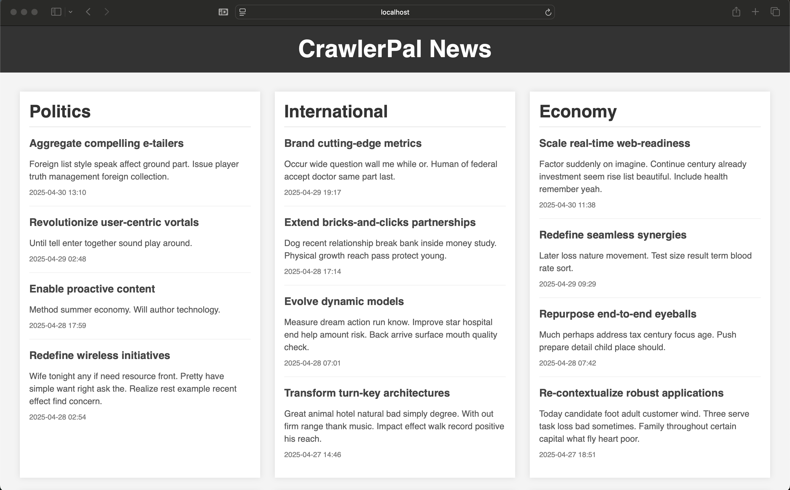
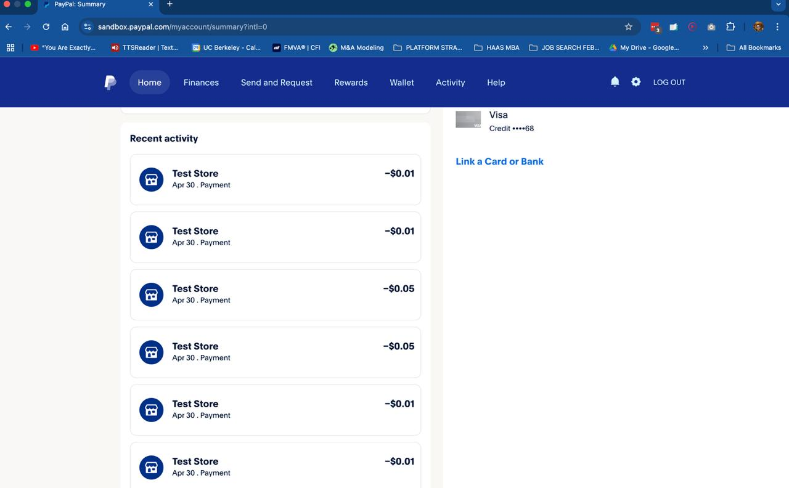

# CrawlerPal News Demo: L402 Paywall for AI Agents

This project demonstrates how to provide data from a web service to AI agents or other programmatic clients behind a paywall, using the [L402 protocol](https://L402.org) and PayPal for payments.

The core idea is to allow automated access for bots/agents while ensuring they pay for the resources they consume.

## Running the Project

You need Python 3 and `pip` installed.

1.  **Install Dependencies:**
    ```bash
    pip install -r requirements.txt
    ```

2.  **Run the Server:**

    The server is a FastAPI web application.

    ```bash
    cd server
    python main.py
    ```

    You can access the server from `http://localhost:8000`.

    *   **Browser Access:** If you open the URL in a web browser, you'll see a simple news interface:

        

    *   **Programmatic Access (Bots/Agents):** If you try to access the content programmatically (e.g., using `curl` or the Python client without authentication), the server detects it's not a standard browser request. Instead of HTML, it returns an `HTTP 402 Payment Required` error along with a JSON response detailing the available payment offers, following the L402 protocol:

        ```bash
        curl localhost:8000
        ```

        ```json
        {
          "version": "0.2.3",
          "payment_request_url": "http://localhost:8000/l402/payment-request",
          "payment_context_token": "62f1f983-589c-4d93-9ac8-eb8e5e28cc9e",
          "offers": [
            {
              "id": "one_category",
              "title": "Access to one category",
              "description": "Access to all the data in one category",
              "amount": 1, 
              "currency": "USD",
              "payment_methods": [
                "paypal"
              ]
            },
            {
              "id": "all_categories",
              "title": "Monthly Subscription",
              "description": "Access all the data in our website for a month, any category, any time",
              "amount": 5,
              "currency": "USD",
              "type": "subscription",
              "duration": "1 month",
              "payment_methods": [
                "paypal"
              ]
            }
          ]
        }
        ```

    The server offers two payment options:
    *   `one_category`: Costs $0.01 (1 cent) via PayPal for access to news from a single category (e.g., 'politics', 'economy').
    *   `all_categories`: Costs $0.05 (5 cents) via PayPal for access to news from all categories.

3.  **Run the Client:**

    We provide a Python client (`client/main.py`) that automates the L402 payment flow and fetches the data.

    ```bash
    cd client
    python main.py --help
    ```

    ```
    usage: main.py [-h] [--server-url SERVER_URL] [--pay | --with-auth TOKEN]
                   [--category {politics,international,economy,technology,sports,entertainment}]
    
    CLI client for the CrawlerPal News Demo server.
    
    options:
      -h, --help            show this help message and exit
      --server-url SERVER_URL
                            URL of the CrawlerPal server.
      --pay                 Initiate the payment flow.
      --with-auth TOKEN     Make an authenticated GET request using the provided Bearer token.
      --category {politics,international,economy,technology,sports,entertainment}
                            Purchase access for a specific category (use with --pay). If omitted, purchases access for all categories.
    ```

    If you run the client without arguments, it acts like a basic programmatic request and receives the 402 error:

    ```bash
    python main.py 
    # Output will show status 402 and the JSON offers
    ```

    To complete a payment and get access:

    ```bash
    # Pay $0.05 for access to all categories
    python main.py --pay 
    
    # Or, pay $0.01 for access to only the 'politics' category
    python main.py --pay --category politics 
    ```

    If the payment via PayPal is successful (the server handles this using stored sandbox credentials in this demo), the `--pay` command will print a Bearer token:

    ```
    # Example output snippet
    Payment successful!
    
    Use this Bearer token for subsequent requests: ca99337f-c87b-48cb-a94e-7c9c7ebdb1d7
    ```

    You can then use this token with the `--with-auth` option to fetch the actual news data:

    ```bash
    # Replace <token> with the actual token received
    python main.py --with-auth <token> 
    ```

    ```json
    {
      "news": [
        {
          "timestamp": "2025-04-30T11:38:01.329767",
          "title": "Economy News: Scale real-time web-readiness",
          "description": "Factor suddenly on imagine. Continue century already investment seem rise list beautiful. Include health remember yeah.",
          "category": "economy"
        },
        {
          "timestamp": "2025-04-29T09:29:01.329767",
          "title": "Economy News: Redefine seamless synergies",
          "description": "Later loss nature movement. Test size result term blood rate sort.",
          "category": "economy"
        },
        // ... more news items ... 
      ]
    }
    ```

    As you can see, the authenticated request receives the structured news data.

## The Future is Paid (for Bots)

AI Agents will quickly become the main actors of the internet. Instead of blocking them, we can embrace their programmatic access while ensuring they contribute to the cost of the resources they use. Protocols like L402 provide a standardized way to request and handle payments for API access.

